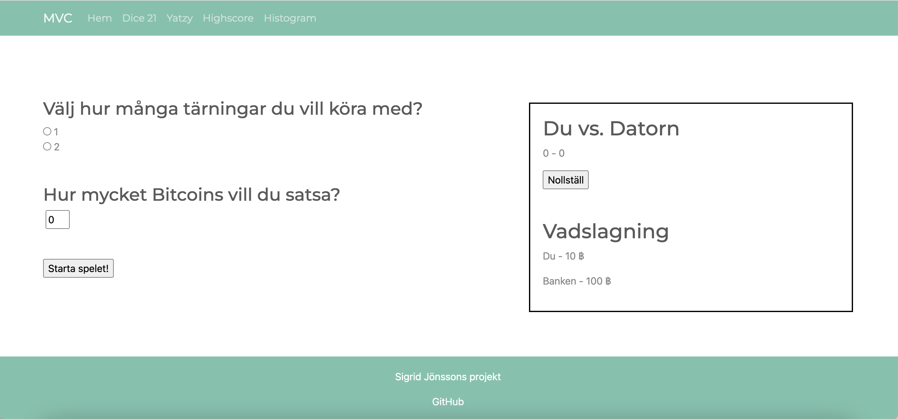
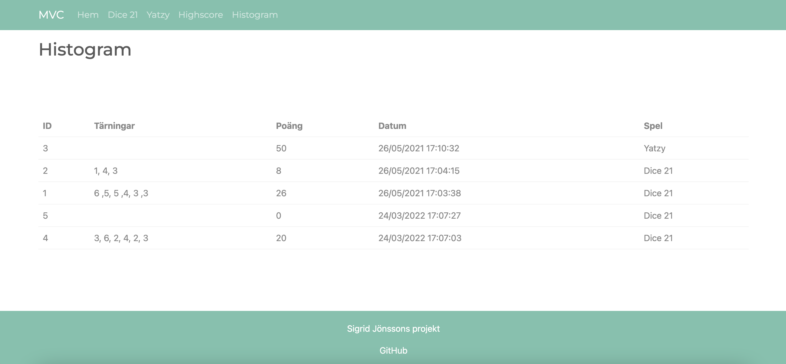

# Project

[](https://travis-ci.com/sigridjonsson/projMvc)

[](https://scrutinizer-ci.com/g/sigridjonsson/projMvc/?branch=master)
[](https://scrutinizer-ci.com/g/sigridjonsson/projMvc/?branch=master)
[](https://scrutinizer-ci.com/g/sigridjonsson/projMvc/build-status/master)

A website made with Symfony and Doctrine where you can play the dice game 21 and
Yatzy. All games are tracked and either all dices, the score or both are saved in a
database. The result is displayed on the website.   
This is made as the final project of the course [mvc](https://dbwebb.se/kurser/mvc-v1)
at BTH.

Get going
-----------------------------------
Install the essentials to get going with the application.
```
composer install
```

Screenshots
-----------------------------------



